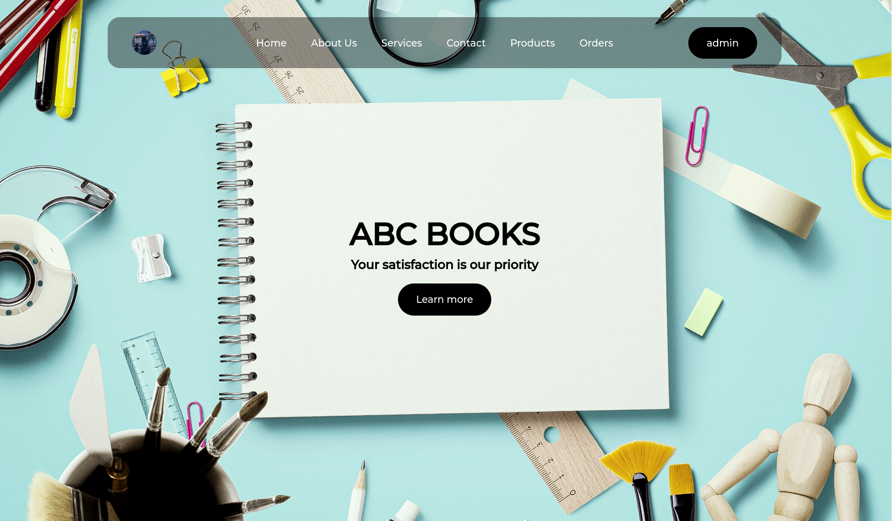

# ABC-Books
In this project, I developed a simple web application for ABC Books and Stationeries using HTML, CSS, PHP, and JavaScript to build a basic e-commerce site. HTML and CSS were used for the user interface, PHP for server-side scripting, and JavaScript for client-side interactions and handling the 'Buy' logic. The project focuses on implementing an e-commerce site with CRUD operations, which are fundamental for persistent storage.


# Home page



# Products Page
This page dynamically queries the database for products and displays them on the page.

```
<?php
    require("../assets/php/config.php");
    require("../assets/php/productsDB.php");

    $sqlselect = "SELECT ID, NAME, PRICE, STOCK_QUANTITY, CATEGORY, PRODUCT_PIC FROM $tbname";
    $result = $conn->query($sqlselect);

    if ($result->num_rows > 0) {
        while ($row = $result->fetch_assoc()) {
            echo "<tr>";
            echo "<td>" . $row["ID"] . "</td>";
            echo "<td>" . $row["NAME"] . "</td>";
            echo "<td> Rs. " . $row["PRICE"] . "</td>";
            echo "<td>" . $row["STOCK_QUANTITY"] . "</td>";
            echo "<td>";
            echo "  <div>";
            echo "    <div>" . $row["CATEGORY"] . "</div>";
            echo "    <div id='icon-wrapper'>";
            echo "      <div id='delete' onclick='processDelete(" . $row["ID"] . ")'></div>";
            echo "      <div id='edit' data-id='" . $row['ID'] . "' data-name='" . $row['NAME'] . "' data-pic='" . $row['PRODUCT_PIC'] . "' data-price='" . $row['PRICE'] . "' data-stock='" . $row['STOCK_QUANTITY'] . "' data-category='" . $row['CATEGORY'] . "' onclick='processEdit(this)'></div>";
            echo "    </div>";
            echo "  </div>";
            echo "</td>";
            echo "</tr>";
        }
    } else {
        echo "<tr><td colspan='4'>NO DATA FOUND</td></tr>";
    }
?>
```


When the 'Buy' button is clicked, the item is added to the cart, which is managed by JavaScript. Buying the same product multiple times will increase its quantity in the cart.

```
<script>
    let list = {};
    let a = 1;

    function processCart(x, y) {
        document.getElementById("cart").style.display = "flex";
        let check = false;

        for (let key in list) {
            if (key == x) {
                check = true;
            }
        }

        if (check) {
            document.getElementById(`cart-item-${x}-quantity`).innerHTML = ++list[x];
        } else {
            list[x] = 1;
            document.getElementById("cart-items-wrappar").innerHTML += `
                <tr class="cart-item-${x}"> 
                    <td> ${a}. </td>
                    <td> ${x} </td>
                    <td> Rs. ${y} </td>
                    <td id="cart-item-${x}-quantity"> 1 </td>
                </tr> 
            `;
            a++;
        }
    }
</script>
```


# Orders page
This page displays a list of ordered items. Clicking the delete button, which appears on hover, will remove the item from the order list.


